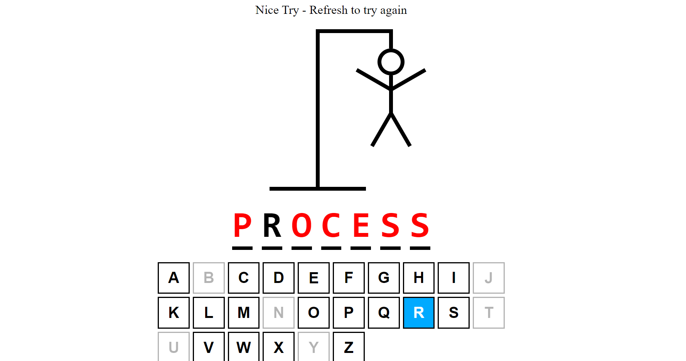

# Hangman With React and Typescript

This app isa simple version of the game hangman built with react and typescript.

## Build Steps ⚙

This project was built with NodeJs -v 16.xx.

Running Locally 🖥️
1. Clone repo using the following command:
    ```shell script
    git clone https://github.com/Itsyaboikris/file-sharing-nodejs.git 
    ```
2. cd in project directory
4. Install dependencies
    ```shell script
    npm install
    ```
5. Run project 🎉
    ```shell script
    npm run devStart
    ```